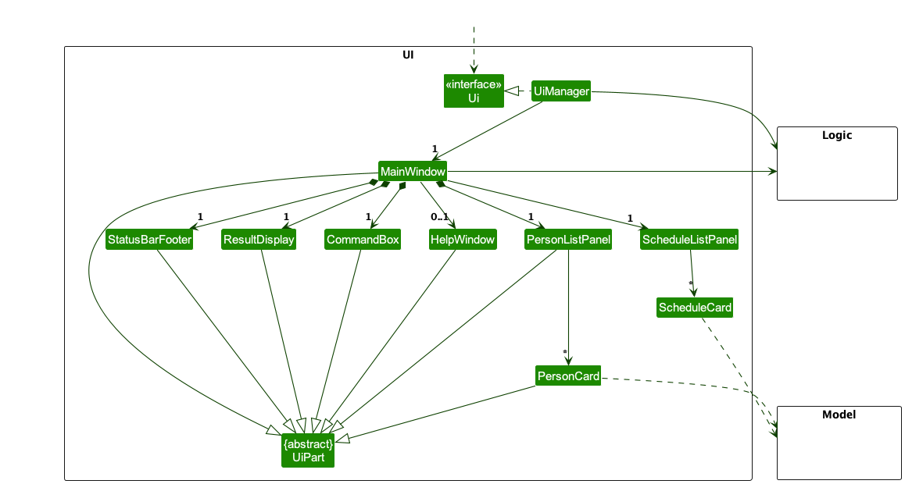
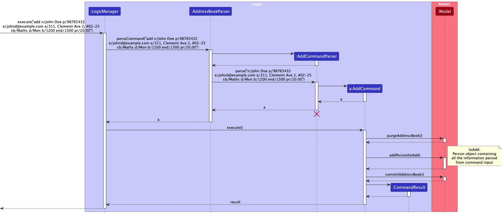
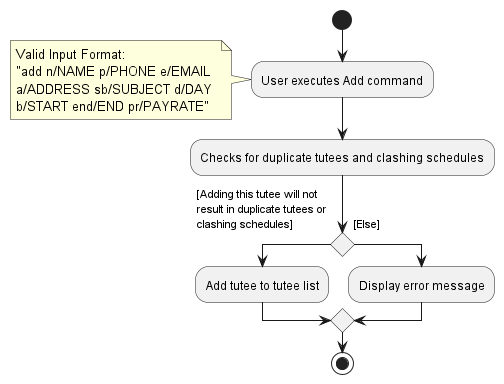
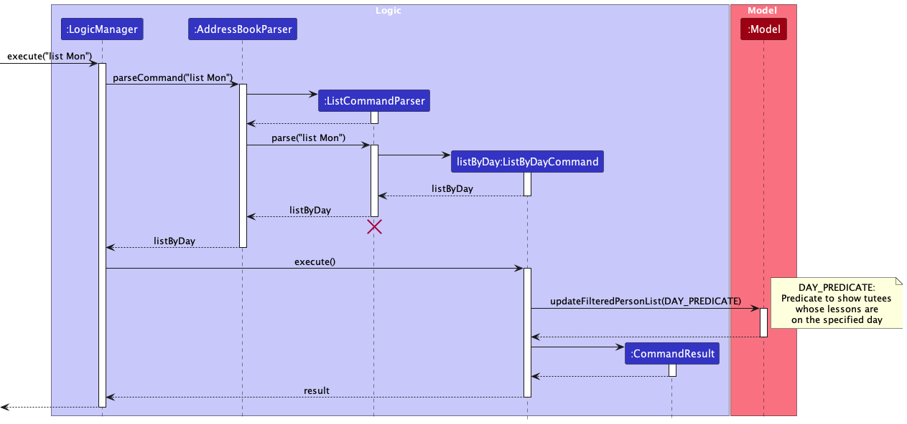
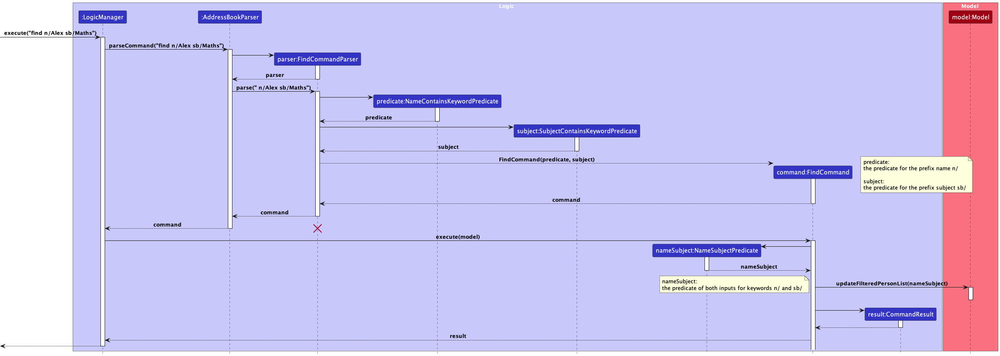
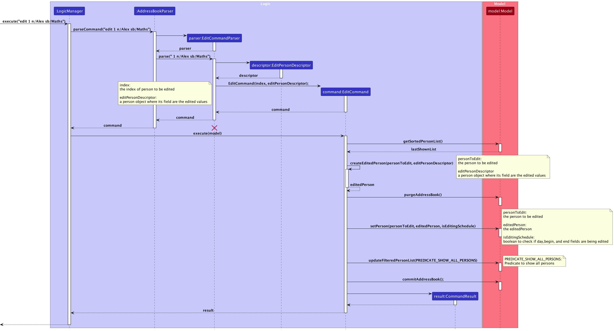
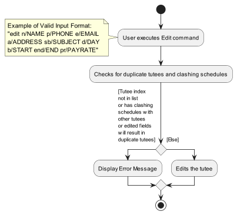
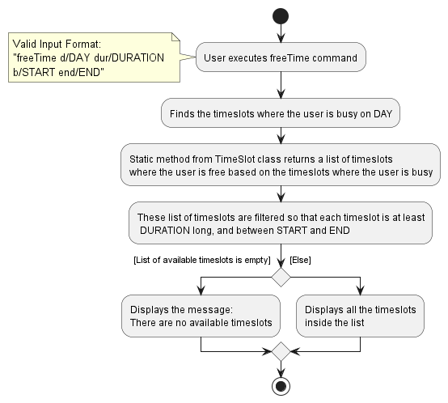
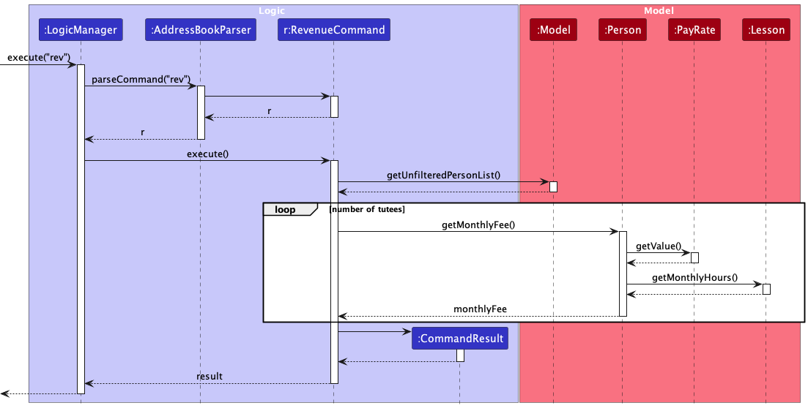
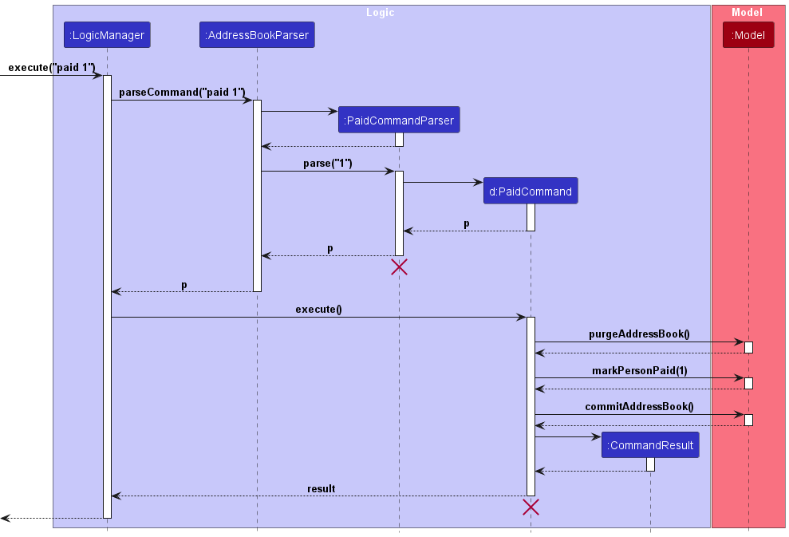

* Table of Contents
{:toc}

--------------------------------------------------------------------------------------------------------------------

## **Acknowledgements**

* {list here sources of all reused/adapted ideas, code, documentation, and third-party libraries -- include links to the original source as well}

--------------------------------------------------------------------------------------------------------------------

## **Setting up, getting started**

Refer to the guide [_Setting up and getting started_](SettingUp.md).

--------------------------------------------------------------------------------------------------------------------

## **Design**

:bulb: **Tip:** The `.puml` files used to create diagrams in this document `docs/diagrams` folder. Refer to the [_PlantUML Tutorial_ at se-edu/guides](https://se-education.org/guides/tutorials/plantUml.html) to learn how to create and edit diagrams.

### Architecture

The ***Architecture Diagram*** given above explains the high-level design of the App.

Given below is a quick overview of main components and how they interact with each other.

**Main components of the architecture**

**`Main`** (consisting of classes [`Main`](https://github.com/AY2324S1-CS2103T-F10-4/tp/blob/master/src/main/java/seedu/address/Main.java) and [`MainApp`](https://github.com/AY2324S1-CS2103T-F10-4/tp/blob/master/src/main/java/seedu/address/MainApp.java)) is in charge of the app launch and shut down.
* At app launch, it initializes the other components in the correct sequence, and connects them up with each other.
* At shut down, it shuts down the other components and invokes cleanup methods where necessary.

The bulk of the app's work is done by the following four components:

* [**`UI`**](#ui-component): The UI of the App.
* [**`Logic`**](#logic-component): The command executor.
* [**`Model`**](#model-component): Holds the data of the App in memory.
* [**`Storage`**](#storage-component): Reads data from, and writes data to, the hard disk.

[**`Commons`**](#common-classes) represents a collection of classes used by multiple other components.

**How the architecture components interact with each other**

The *Sequence Diagram* below shows how the components interact with each other for the scenario where the user issues the command `delete 1`.

Each of the four main components (also shown in the diagram above),

* defines its *API* in an `interface` with the same name as the Component.
* implements its functionality using a concrete `{Component Name}Manager` class (which follows the corresponding API `interface` mentioned in the previous point.

For example, the `Logic` component defines its API in the `Logic.java` interface and implements its functionality using the `LogicManager.java` class which follows the `Logic` interface. Other components interact with a given component through its interface rather than the concrete class (reason: to prevent outside component's being coupled to the implementation of a component), as illustrated in the (partial) class diagram below.

The sections below give more details of each component.

### UI component

The **API** of this component is specified in [`Ui.java`](https://github.com/AY2324S1-CS2103T-F10-4/tp/blob/master/src/main/java/seedu/address/ui/Ui.java)

The UI consists of a `MainWindow` that is made up of parts e.g.`CommandBox`, `ResultDisplay`, `PersonListPanel`, `ScheduleListPanel`, `StatusBarFooter` etc. All these, including the `MainWindow`, inherit from the abstract `UiPart` class which captures the commonalities between classes that represent parts of the visible GUI.

The `UI` component uses the JavaFx UI framework. The layout of these UI parts are defined in matching `.fxml` files that are in the `src/main/resources/view` folder. For example, the layout of the [`MainWindow`](https://github.com/AY2324S1-CS2103T-F10-4/tp/blob/master/src/main/java/seedu/address/ui/MainWindow.java) is specified in [`MainWindow.fxml`](https://github.com/AY2324S1-CS2103T-F10-4/tp/blob/master/src/main/resources/view/MainWindow.fxml)

The `UI` component,

* executes user commands using the `Logic` component.
* listens for changes to `Model` data so that the UI can be updated with the modified data.
* keeps a reference to the `Logic` component, because the `UI` relies on the `Logic` to execute commands.
* depends on some classes in the `Model` component, as it displays `Person` object residing in the `Model`.

### Logic component

**API** : [`Logic.java`](https://github.com/AY2324S1-CS2103T-F10-4/tp/blob/master/src/main/java/seedu/address/logic/Logic.java)

Here's a (partial) class diagram of the `Logic` component:

The sequence diagram below illustrates the interactions within the `Logic` component, taking `execute("delete 1")` API call as an example.

:information_source: **Note:** The lifeline for `DeleteCommandParser` should end at the destroy marker (X) but due to a limitation of PlantUML, the lifeline reaches the end of diagram.

How the `Logic` component works:

1. When `Logic` is called upon to execute a command, it is passed to an `AddressBookParser` object which in turn creates a parser that matches the command (e.g., `DeleteCommandParser`) and uses it to parse the command.
1. This results in a `Command` object (more precisely, an object of one of its subclasses e.g., `DeleteCommand`) which is executed by the `LogicManager`.
1. The command can communicate with the `Model` when it is executed (e.g. to delete a person).
1. The result of the command execution is encapsulated as a `CommandResult` object which is returned back from `Logic`.

Here are the other classes in `Logic` (omitted from the class diagram above) that are used for parsing a user command:

How the parsing works:
* When called upon to parse a user command, the `AddressBookParser` class creates an `XYZCommandParser` (`XYZ` is a placeholder for the specific command name e.g., `AddCommandParser`) which uses the other classes shown above to parse the user command and create a `XYZCommand` object (e.g., `AddCommand`) which the `AddressBookParser` returns back as a `Command` object.
* All `XYZCommandParser` classes (e.g., `AddCommandParser`, `DeleteCommandParser`, ...) inherit from the `Parser` interface so that they can be treated similarly where possible e.g, during testing.

### Model component
**API** : [`Model.java`](https://github.com/AY2324S1-CS2103T-F10-4/tp/blob/master/src/main/java/seedu/address/model/Model.java)

The `Model` component,

* stores the tutee data i.e., all `Person` objects (which are contained in a `UniquePersonList` object).
* stores the currently 'selected' `Person` objects (e.g., results of a search query) as a separate _filtered_ list which is exposed to outsiders as an unmodifiable `ObservableList<Person>` that can be 'observed' e.g. the UI can be bound to this list so that the UI automatically updates when the data in the list change.
* stores a `UserPref` object that represents the user’s preferences. This is exposed to the outside as a `ReadOnlyUserPref` objects.
* does not depend on any of the other three components (as the `Model` represents data entities of the domain, they should make sense on their own without depending on other components)

### Storage component

**API** : [`Storage.java`](https://github.com/AY2324S1-CS2103T-F10-4/tp/blob/master/src/main/java/seedu/address/storage/Storage.java)

The `Storage` component,
* can save both address book data and user preference data in JSON format, and read them back into corresponding objects.
* inherits from both `AddressBookStorage` and `UserPrefStorage`, which means it can be treated as either one (if only the functionality of only one is needed).
* depends on some classes in the `Model` component (because the `Storage` component's job is to save/retrieve objects that belong to the `Model`)

### Common classes

Classes used by multiple components are in the `seedu.addressbook.commons` package.

--------------------------------------------------------------------------------------------------------------------

## **Implementation**

This section describes some noteworthy details on how certain features are implemented.

### Add feature
The `AddCommand` extends the `Command` class. While mostly similar to `delete` illustrated above, the command contains 
checks to prevent any duplicate `Person` object (i.e. same name and phone number) as well as clashes in schedules. 
If it passes these checks, the person is added into the system.

`AddCommand` takes in the following fields:
* **Name (Compulsory field)**: String composed of character between A-Z and a-z.
* **Phone number (Compulsory field)**: Any number at least 3 digits long.
* **Email (Compulsory field)** String with restrictions in characters (XXXXXXXX@emaildomain)
* **Address (Compulsory field)**: String without restriction in characters.
* **Subject (Compulsory field)**: String without restriction in characters.
* **Day (Compulsory field)**: String with restrictions in characters, non-case sensitive (Mon/Monday/Tue/Tuesday/Wed/Wednesday/Thu/Thursday/Fri/Friday/Sat/Saturday/Sun/Sunday).
* **Begin (Compulsory field)**: String with restrictions (HHMM).
* **End (Compulsory field)**: String with restrictions (HHMM).
* **PayRate (Compulsory field)**: String with restrictions in characters, only numbers allowed (no negative numbers)

The following sequence diagram shows how the add command works.

The following activity diagram summarizes what happens when a user executes a new command:

#### Design considerations:

**Aspect: How add executes:**

* **Alternative 1 (current choice):** All fields must be included in a single command input.
    * Pros: Easy to implement.
    * Cons: Command input may be too long and less user-friendly.

* **Alternative 2**: Allow for optional parameters with default values, with the tutee's name and phone being the compulsory ones.
  * Pros: More user-friendly, command will not be too lengthy.
  * Cons: Harder to implement. 

### List feature

There are three commands that deal with listing tutees:

1. `ListCommand` - Shows the current list of all tutees in the list
2. `ListByDayCommand` - Shows the current list of tutees who have lessons on a specified day
3. `ListUnPaidCommand` - Shows the current list of tutees who have not paid

The `ListCommand` extends the `Command` class. Both the `ListByDayCommand` and the `ListUnPaidCommand` extend the `ListCommand` class. All three commands override `Command#execute`.
The `ListCommandParser` is responsible for returning the appropriate `ListCommand`  based on the command format.

The `ListByDayCommand`  is initialised with a `DayPredicate` and updates the `FilteredPersonList` to only display Persons whose `Day` field matches the specified input.

The following sequence diagram shows how the list by day command works.

The `ListUnPaidCommand`  follows a similar implementation to `ListByDayCommand`. It is initialised with a `PaidPredicate` instead and updates
the `FilteredPersonList` to only display Persons whose `isPaid` field is false.

**Aspect: How to implement `ListByDayCommand` and `ListUnPaidCommand`:**

* **Alternative 1 (current choice):** Extend the `ListCommand` class.
    * Pros: Greater use of OOP.
    * Cons: Harder to implement.

* **Alternative 2:** Individual command class without extending `ListCommand`.
    * Pros: Easier to implement.
    * Cons: Less abstraction.

### Find feature
The `findCommand` extends the `Command` class. It allows the user to find for tutees by specifying their names and/or 
subject using their prefixes.

The following sequence diagram shows how the find command works.

### Edit feature
The `editCommand` extends the `Command` class. It allows the user to edit fields of the tutee by specifying the index
of the tutee.

The following sequence diagram shows how the edit command works.

The following activity diagram summarizes what happens when a user executes an edit command:

### Find Free Time feature

The `freeTime` Command extends the `Command` class.

`freeTime` takes in the following fields: 
* **Day (Compulsory field)**: String with restrictions in characters, non-case sensitive (Mon/MondayTue/Tuesday/Wed/Wednesday/Thu/Thursday/Fri/Friday/Sat/Saturday/Sun/Sunday).
* **Duration (Compulsory field)**: Positive Integer to represent duration in **minutes**.
* **Begin (Compulsory field)**: String with restrictions (HHMM).
* **End (Compulsory field)**: String with restrictions (HHMM).

It displays a list of timeslots where the user is free on that _Day_, starting from _Begin_ to _End_. The timeslots listed down
must also be greater than the duration provided. 

The following sequence diagram shows how the freeTime command works.

#### Design Considerations
**Aspect: How `freeTime` executes:**

* **Alternative 1 (current choice):** The command first finds timeslots when the user is busy on that _Day_ by looking at the tutees' schedules inside the
  `UniquePersonList`. The TimeSlot Class finds free time based on the list of
  timeslots when the user is busy, and then returns a list of timeslots where the user is free. (Each timeslot is between _Begin_ and _End_,
and is at least _Duration_ long)
  * Pros: Command is short and simple to use.
  * Cons: During the first round of user-testing, some new users were confused on how to use the command. 

The following activity diagram summarizes what happens when a user executes a new command:

### Calculate total revenue for the month

The 'RevenueCommand' extends the 'command class'. The command first gets a list containing all tutees.
The total revenue monthly can be calculated now by iterating through the list and calling 'getMonthlyRevenue()' on each
tutee.

*Total Revenue* = number of tutees x tutee.getMonthlyRevenue()

The following sequence diagram shows how the total revenue command works:

### Undo/redo feature

The undo/redo mechanism is facilitated by `VersionedAddressBook`. It extends `AddressBook` with an undo/redo history, stored internally as an `addressBookStateList` and `currentStatePointer`. Additionally, it implements the following operations:

* `VersionedAddressBook#commit()` — Saves the current address book state in its history.
* `VersionedAddressBook#undo()` — Restores the previous address book state from its history.
* `VersionedAddressBook#redo()` — Restores a previously undone address book state from its history.

These operations are exposed in the `Model` interface as `Model#commitAddressBook()`, `Model#undoAddressBook()` and `Model#redoAddressBook()` respectively.

Given below is an example usage scenario and how the undo/redo mechanism behaves at each step.

Step 1. The user launches the application for the first time. The `VersionedAddressBook` will be initialized with the initial address book state, and the `currentStatePointer` pointing to that single address book state.

Step 2. The user executes `delete 5` command to delete the 5th person in the address book. The `delete` command calls `Model#commitAddressBook()`, causing the modified state of the address book after the `delete 5` command executes to be saved in the `addressBookStateList`, and the `currentStatePointer` is shifted to the newly inserted address book state.

Step 3. The user executes `add n/David …​` to add a new person. The `add` command also calls `Model#commitAddressBook()`, causing another modified address book state to be saved into the `addressBookStateList`.

:information_source: **Note:** If a command fails its execution, it will not call `Model#commitAddressBook()`, so the address book state will not be saved into the `addressBookStateList`.

Step 4. The user now decides that adding the person was a mistake, and decides to undo that action by executing the `undo` command. The `undo` command will call `Model#undoAddressBook()`, which will shift the `currentStatePointer` once to the left, pointing it to the previous address book state, and restores the address book to that state.

:information_source: **Note:** If the `currentStatePointer` is at index 0, pointing to the initial AddressBook state, then there are no previous AddressBook states to restore. The `undo` command uses `Model#canUndoAddressBook()` to check if this is the case. If so, it will return an error to the user rather
than attempting to perform the undo.

The following sequence diagram shows how the undo operation works:

:information_source: **Note:** The lifeline for `UndoCommand` should end at the destroy marker (X) but due to a limitation of PlantUML, the lifeline reaches the end of diagram.

The `redo` command does the opposite — it calls `Model#redoAddressBook()`, which shifts the `currentStatePointer` once to the right, pointing to the previously undone state, and restores the address book to that state.

:information_source: **Note:** If the `currentStatePointer` is at index `addressBookStateList.size() - 1`, pointing to the latest address book state, then there are no undone AddressBook states to restore. The `redo` command uses `Model#canRedoAddressBook()` to check if this is the case. If so, it will return an error to the user rather than attempting to perform the redo.

Step 5. The user then decides to execute the command `list`. Commands that do not modify the address book, such as `list`, will usually not call `Model#commitAddressBook()`, `Model#undoAddressBook()` or `Model#redoAddressBook()`. Thus, the `addressBookStateList` remains unchanged.

Step 6. The user executes `clear`, which calls `Model#commitAddressBook()`. Since the `currentStatePointer` is not pointing at the end of the `addressBookStateList`, all address book states after the `currentStatePointer` will be purged. Reason: It no longer makes sense to redo the `add n/David …​` command. This is the behavior that most modern desktop applications follow.

The following activity diagram summarizes what happens when a user executes a new command:

#### Design considerations:

**Aspect: How undo & redo executes:**

* **Alternative 1 (current choice):** Saves the entire address book.
  * Pros: Easy to implement.
  * Cons: May have performance issues in terms of memory usage.

* **Alternative 2:** Individual command knows how to undo/redo by
  itself.
  * Pros: Will use less memory (e.g. for `delete`, just save the person being deleted).
  * Cons: We must ensure that the implementation of each individual command are correct.

### Mark paid/unpaid features
The proposed mark paid/check paid mechanism can check whether the person has paid or not by implementing a new boolean field 'paid' in the person object, it implements the following operations:

* `paid [index]` — Mark the person at the index as paid.
* `unpaid [index]` — Mark the person at the index as not paid.
* `list unpaid` — List all the persons who haven't paid in the list.
* `unpaidAll` — Reset all students' payment status to not paid.

The following sequence diagram shows how paid command works:

The unpaid command works similar to the paid command.

The following sequence diagram shows how unpaidAll command works:

#### Design considerations:

**Aspect: The choice of paid data type:**

* **Alternative 1 (current choice):** Use simple boolean value.
    * Pros: Easy to implement, fits the requirement: two status (paid, not paid).
    * Cons: Different from all other fields in the person class, hard to maintain.

* **Alternative 2:** Create a new paid class.
    * Pros: Fits the other fields in the class.
    * Cons: Hard to implement, waste of source.

**Aspect: How to implement mark paid features:**

* **Alternative 1 (current choice):** Create a new person, set everything else the same as before, and set paid as true.
    * Pros: Since we created a new person, the previous person's status will not change, this will benefit the design of undo/redo.
    * Cons: Hard to implement.

* **Alternative 2:** Change the paid value of the current person.
    * Pros: Easy to implement.
    * Cons: The future design of redo/undo command would be difficult.

--------------------------------------------------------------------------------------------------------------------

## **Documentation, logging, testing, configuration, dev-ops**

* [Documentation guide](Documentation.md)
* [Testing guide](Testing.md)
* [Logging guide](Logging.md)
* [Configuration guide](Configuration.md)
* [DevOps guide](DevOps.md)

--------------------------------------------------------------------------------------------------------------------

## **Appendix: Requirements**

### Product scope

**Target user profile**: Private tutors not affiliated to any tuition organisations

* has a need to manage multiple tutees
* has a need for managing personal tutoring schedule 
* prefer desktop apps over other types
* can type fast
* prefers typing to mouse interactions
* is reasonably comfortable using CLI apps

**Value proposition**: It is tedious for tutors to keep track of multiple students and this is done conventionally through calendar applications. Simplify tutoring business with TuitionConnect. Effortlessly manage students, schedules and progress tracking while ensuring financial organization in an all in one product at a faster rate than non CLI applications.

### User stories

Priorities: High (must have) - `* * *`, Medium (nice to have) - `* *`, Low (unlikely to have) - `*`

| Priority | As a …​                                        | I want to …​                                    | So that I can…​                                                        |
| ------ |------------------------------------------------|-------------------------------------------------|------------------------------------------------------------------------|
| `* * *` | tutor                                          | view a list of all tutees                       |                                                                        |
| `* *`  | tutor                                          | view a list tutees on a specified day           | so that I can be reminded if I have any classes on that particular day |
| `* * *` | tutor                                          | view the specific details of a single tutee     |                                                                        |
| `* * *` | tutor                                          | add a new tutee                                 |                                                                        |
| `* * *` | tutor                                          | edit their details                              | account for changes in their information e.g. change in address        |
| `* *`  | tutor                                          | remove tutees from the list                     | keep track of tutees that I have stopped teaching                      |
| `* *`  | tutor                                          | mark students that have already paid            | keep track of students' payment statuses                               |
| `* *`  | tutor                                          | check all students who haven't paid             | easily remind students who haven't paid                                |
| `* *`  | tutor                                          | undo and redo commands I made in the application | easily revert any mistakes                                             |
| `* *`  | tutor                                          | calculate my total monthly revnue               | better financially plan for my tutoring business                       |

*{More to be added}*

### Use cases

(For all use cases below, the **System** is the `TuitionConnect` and the **Actor** is the `user`, unless specified otherwise)

**Use case: UC01 - View all tutees**

**MSS**

1.  User requests to view all tutees.
2.  System shows all tutees.
	
    Use case ends.

**Extensions**

- 2a. The list of tutees is empty.
    - 2a1. System informs the user that the list is empty.
	
    Use case ends.
     
     

**Use case: UC02 - Add a tutee**

**MSS**

1. User requests to add a tutee.
2. System adds a tutee.

   Use case ends.

**Extensions**

- 1a. User inputs incomplete tutee data.  
    - 1a1. System informs user of the incomplete tutee data.

      Use case resumes at 1.

- 1b. User inputs a name that already exists in the address book.
    - 1b1. System informs user about that name being taken already.

      Use case resumes at 1.
  
- 1c. User inputs a clash in schedule.
    - 1c1. System informs user of the clash in schedules.

      Use case resumes at 1.
  
- 1d. User inputs begin time which is greater than the end time.
  - 1d1. System informs that begin time must be smaller than the end time.

    Use case resumes at 1.

     
     
  
**Use case: UC03 - Delete a tutee**

**MSS**

1.  User views the list of tutees.
2.  User requests to delete a tutee.
3.  System deletes the tutee.

    Use case ends.

**Extensions**

- 2a. The tutee that the user is trying to delete does not exist in the list.
    - 2a1. System informs that user does not exist.

       
       

**Use case: UC04 - Editing a tutee**

**MSS**

1.  User views the list of tutees.
2.  User requests to edit a tutee.
3.  System edit the tutee

    Use case ends.

**Extensions**

  
- 2a. The schedule of the edited tutee clashes with an existing schedule.
  - 2a1. System informs that there is a clash in schedules.

    Use case resumes at 2.
  
- 2b. The edited begin time is after than the original end time.
  - 2b1. System informs that begin time must be smaller than the end time.

    Use case resumes at 2.
  
- 2c. The edited end time is before the original begin time.
  - System informs that begin time must be smaller than the end time.

    Use case resumes at 2.
  
- 2d. The edited begin time is after the edited begin time.
  - 2d1. System informs that begin time must be smaller than the end time.
    
    Use case resumes at 2.
     
     

**Use case: UC05 - Mark a tutee as paid**

**MSS**

1.  User views the list of tutees.
2.  User requests mark the specific tutee as paid.
3.  System marks the tutee as paid.

    Use case ends.

**Extensions**

- 2a. The tutee that the user is trying to mark as paid does not exist in the list.
    - 2a1. System informs that user does not exist.

   
   

**Use case: UC06 - Reset all tutees in the list to not paid**

**MSS**

1.  User views the list of tutees.
2.  User requests mark all the tutees in the current list as not paid.
3.  System marks all the tutee in the list as not paid.

    Use case ends.
     
     

**Use case: UC07 - Undo a command**

**MSS**
1. User requests to undo.
2. System updates the tutee data to the previous state.
3. System informs user that the command is undone.

   Use case ends.

**Extensions**
* 1a. No command to be undone.
    * 1a1. System informs user that there is nothing to undo.

  Use case ends.
   
   

**Use case: UC07 - Redo a command**

**MSS**
1. User requests to redo.
2. System updates the tutee data to the next state.
3. System informs user that the command is redone.

   Use case ends.

**Extensions**
* 1a. No command to be redone.
    * 1a1. System informs user that there is nothing to redo.

  Use case ends.
   
   

*{More to be added}*

**Use case: UC07 - Finding free time**

**MSS**
1. User requests to find free time
2. System shows the list of available free time

**Extensions**
- 2a. The user does not have any free slots available.
  - 2a1. System informs that the user has no available timeslots.

**Use case: UC08 - Get monthly revenue**

**MSS**

1. User requests for monthly revenue.
2. User receives monthly revenue figure.

   Use case ends.

### Non-Functional Requirements

1.  Should work on any _mainstream OS_ as long as it has Java `11` or above installed.
2.  The software should be platform independent (i.e. work on the Windows, Linux, and OS-X platforms).
3. Should be able to hold up to 1000 persons without a noticeable sluggishness in performance for typical usage.
4. A user with above average typing speed for regular English text (i.e. not code, not system admin commands) should be able to accomplish most of the tasks faster using commands than using the mouse.
5. The product is a single user product (i.e. The data file created by one user cannot be accessed by another user during regular operations)
6. The data should be stored locally and should be in a human editable text file.
7. The product should not use a DBMS to store data.
8. The software should work without requiring an installer.
9. The software should not depend on a remote server.
10. The GUI should work well (i.e., should not cause any resolution-related inconveniences to the user) for, standard screen resolutions 1920x1080 and higher, and, for screen scales 100% and 125%.
11. the GUI should be usable (i.e., all functions can be used even if the user experience is not optimal) for, resolutions 1280x720 and higher, and, for screen scales 150%.
12. The product should be packaged into a single JAR file.
13. The DG and UG should be PDF-friendly. Expandable panels, embedded videos, animated GIFs should not be used.
14. The file sizes of the deliverables should be reasonable and not exceed the limits given below:

    - Product (i.e., the JAR/ZIP file): 100MB

    - Documents (i.e., PDF files): 15MB/file

### Glossary

* Calendar Applications: Digital tools for organizing and managing schedules, events, and tasks.
* Shortcut Commands:  Quick combinations of keystrokes that trigger specific actions in a software application.
* Participation Grade: The grade used to assess a student's active involvement and engagement during academic activities.
* Academic Performance: It represents a student's achievements and results in the study, including grades, exam scores, projects and so on.
--------------------------------------------------------------------------------------------------------------------

## **Appendix: Instructions for manual testing**

Given below are instructions to test the app manually.

:information_source: **Note:** These instructions only provide a starting point for testers to work on;
testers are expected to do more *exploratory* testing.

### Launch and shutdown

1. Initial launch

   1. Download the jar file and copy into an empty folder

   1. Double-click the jar file Expected: Shows the GUI with a set of sample contacts. The window size may not be optimum.

1. Saving window preferences

   1. Resize the window to an optimum size. Move the window to a different location. Close the window.

   1. Re-launch the app by double-clicking the jar file. 
       Expected: The most recent window size and location is retained.

1. _{ more test cases …​ }_

### Deleting a person

1. Deleting a person while all persons are being shown

   1. Prerequisites: List all persons using the `list` command. Multiple persons in the list.

   1. Test case: `delete 1` 
      Expected: First contact is deleted from the list. Details of the deleted contact shown in the status message. Timestamp in the status bar is updated.

   1. Test case: `delete 0` 
      Expected: No person is deleted. Error details shown in the status message. Status bar remains the same.

   1. Other incorrect delete commands to try: `delete`, `delete x`, `...` (where x is larger than the list size) 
      Expected: Similar to previous.

1. _{ more test cases …​ }_

### Saving data

1. Dealing with missing/corrupted data files

   1. _{explain how to simulate a missing/corrupted file, and the expected behavior}_

1. _{ more test cases …​ }_

## **Planned Enhancements**

### Batch Processing for Paid Command:

Reason: This enhancement allows users to mark multiple persons as paid in a single command, improving efficiency.

Idea: Modify the paid command parser to accept a list of person identifiers (e.g., "paid 1, 2, 3"), and update the command execution logic to iterate through the list and mark each person as paid.

### Scheduled Unpaid Marking

Reason: Introduce a scheduling feature within the unpaid command to set future unpaid statuses for individuals. This would be beneficial for scenarios where payments should automatically lapse after a set period.

Idea: Add a scheduling mechanism within the command execution to mark individuals as unpaid after a specified future date or duration.

### Maximum PayRate

Reason: PayRate that are extremely high may not be displayed properly by GUI and are unlikely to be realistic PayRates per hour anyway.

Idea: Modify the VALIDATION_REGEX of PayRate such that it only accepts values up to 9999.99.
